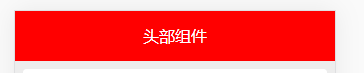
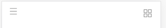
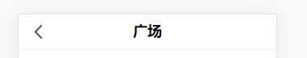

# UI


weui堆组件

# 设计一个复用的头部





一个头部会有多个状态，就是在不用页面使用的时候，会不用的功能

```js
<header>
    <div class="leftIcon">
        
    </div>
    <div class="title" v-text="title"></div>
    <div class="rightIcon">
        
    </div>
</header>
```
利用插槽和props实现同一个组件不同的状态
```html
<Header color="blue" status="2">
    <div>百度</div>
</Header>
<Header title="支付宝" color="red" status="1">
    <div>支付宝</div>
</Header>
<Header title="腾讯" color="green" status="0">
    <div>腾讯应用宝</div>
</Header>
```

# 组件是支持用sass

支持预编译，需要在脚手架里面安装`sass-loader`，
```bash
npm install sass-loader node-sass
```
```html
<style lang="scss">
header {
  text-align: center;
  line-height: 50px;
  width: 100%;
  height: 50px;
  color: white;
  background-color: red;
  display: flex;
}
</style>
```